# Mashinani o'rganish va ilg'or tahlillar yordamida IoT sensori ma'lumotlarini tahlil qiling

Ushbu kod namunasi IBM Db2 Event Store bilan o'zaro ishlash uchun Jupyter noutbuklaridan foydalanishni namoyish etadi -- ma'lumotlar bazasi ob'ektlarini yaratishdan tortib, ilg'or tahlil va mashinani o'rganish modelini ishlab chiqish va joylashtirishgacha.

Ushbu kod namunasida ishlatiladigan namunaviy ma'lumotlar haqiqiy sanoat IoT sensorlari tomonidan to'plangan ma'lumotlarni simulyatsiya qiladi. IoT namunasi maʼlumotlariga sensor harorati, atrof-muhit harorati, quvvat sarfi va noyob sensor identifikatorlari va qurilma identifikatorlari bilan aniqlangan bir guruh sensorlar uchun vaqt tamgʻasi kiradi.
Oddiy IBM Streams oqimi CSV faylidan Event Store jadvaliga namuna ma'lumotlarini oqimlash uchun ishlatiladi.

Db2 Voqealar do'koni - bu Apache Spark va Apache Parket ma'lumotlar formatida qurilgan, katta tuzilgan ma'lumotlar hajmlari va real vaqtda tahlil qilish uchun mo'ljallangan xotiradagi ma'lumotlar bazasi. Yechim voqealarga asoslangan ma'lumotlarni qayta ishlash va tahlil qilish uchun optimallashtirilgan. U IoT yechimlari, toʻlovlar, logistika va veb-tijorat kabi voqealarga asoslangan rivojlanayotgan ilovalarni qoʻllab-quvvatlashi mumkin. U moslashuvchan, kengaytiriladigan va vaqt o'tishi bilan o'zgaruvchan biznes ehtiyojlaringizga tezda moslasha oladi. Db2 Event Store bepul ishlab chiquvchi nashrida va hozir yuklab olishingiz mumkin bo'lgan korporativ nashrda mavjud. Korxona nashri oldindan ishlab chiqarish va sinovdan o‘tkazish uchun bepul, qo‘shimcha ma’lumot olish uchun [rasmiy mahsulot veb-sahifasiga](https://www.ibm.com/products/db2-event-store) tashrif buyuring.

> Eslatma: Db2 Event Store IBM Watson Studio bilan yaratilgan

Ushbu kod namunasini to'ldirgandan so'ng, qanday qilishni tushunasiz:

* Python va Jupyter noutbukidan foydalanib Db2 Event Store bilan o'zaro aloqada bo'ling.
* Db2 Event Store'ga ma'lumotlarni yuborish uchun IBM Streams dasturidan foydalaning.
* Matplotlib diagrammalaridan foydalangan holda ma'lumotlarni ingl.
* Mashinani o'rganish modelini yarating va sinab ko'ring.
* Watson Machine Learning bilan modelni o'rnating va foydalaning.

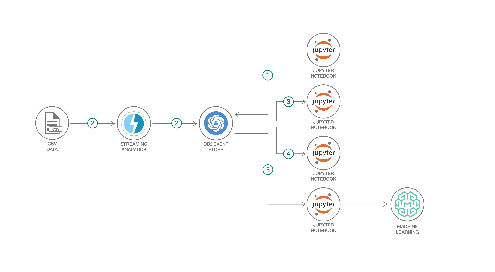

## Flow

1. Db2 Event Store ma'lumotlar bazasi va jadvalini yarating.
2. IoT ma'lumotlar to'plamini Db2 Event Store'ga yuboring.
3. Spark SQL yordamida jadvalga so‘rov o‘tkazing.
4. Matplotlib diagrammalari yordamida ma’lumotlarni tahlil qiling.
5. Mashinani o'rganish modelini yaratish va joylashtirish.

## Db2 EventStore-ni Cloud Pak for Data (CPD) da ishga tushirish

Agar sizda Cloud Pak for Data namunasi oʻrnatilgan boʻlsa, Db2 EventStore’ni CPD’da ishga tushirish uchun [Cloud Pak Readme](README_CLOUDPAK.md) ga amal qiling.
Aks holda, komponentlarni mahalliy sifatida joylashtirish uchun quyidagi amallarni bajaring.

## Qadamlar

1. [Clone the repo](#1-clone-the-repo)
2. [Install the prerequisites](#2-install-the-prerequisites)
3. [Create an IBM Db2 Event Store database and table](#3-create-an-ibm-db2-event-store-database-and-table)
4. [Add the sample IoT data](#4-add-the-sample-iot-data)
5. [Query the table](#5-query-the-table)
6. [Analyze the data](#6-analyze-the-data)
7. [Create and deploy a machine learning model](#7-create-and-deploy-a-machine-learning-model)

### 1. Clone the repo

Clone the `db2-event-store-iot-analytics` repo locally. In a terminal, run:

```bash
git clone https://github.com/IBM/db2-event-store-iot-analytics
```

### 2. Install the prerequisites

#### Install Event Store

> Note: This code pattern was developed with EventStore-DeveloperEdition 1.1.4

1. Install IBM® Db2® Event Store Developer Edition on Mac, Linux, or Windows by following the instructions [here.](https://www.ibm.com/products/db2-event-store)

#### Install IBM Streams

> Note: This is optional if you prefer to use the provided Jupyter notebook to load the data.

1. Install the Quick Start Edition(QSE) Docker image for IBM Streams 4.3.1 by following the instructions [here](https://www.ibm.com/support/knowledgecenter/SSCRJU_4.3.0/com.ibm.streams.qse.doc/doc/qse-docker.html).

1. Download the toolkit for Event Store Developer Edition 1.1.4 [here](https://github.com/IBMStreams/streamsx.eventstore/releases/tag/v1.2.0-Developer-v1.1.4).

1. Extract the contents of the toolkit. For example, you can make a `toolkits` directory in the hostdir that you mapped to a local dir when installing the Quick Start Edition and extract the files into that directory.

   ```bash
   mkdir $HOME/hostdir/toolkits
   tar -zxvf  streamsx.eventstore_1.2.0-RELEASE.tgz -C $HOME/hostdir/toolkits/
   ```

### 3. Create an IBM Db2 Event Store database and table

The Db2 Event Store database and table can be created with one of the Jupyter notebooks provided. Refer to the notebook comments if you need to drop your existing database or table.

Use the Db2 Event Store UI to create and run a notebook as follows:

1. From the upper-left corner `☰` drop down menu, select `My Notebooks`.
1. Click on `add notebooks`.
1. Select the `From File` tab.
1. Provide a name.
1. Click `Choose File` and navigate to the `notebooks` directory in your cloned repo. Open the Jupyter notebook file named **`Event_Store_Table_Creation.ipynb`**.
1. Scroll down and click on `Create Notebook`.
1. Edit the `HOST` constant in the first code cell. You will need to enter your host's IP address here.
1. Run the notebook using the menu `Cell ▷ Run all` or run the cells individually with the play button.

### 4. Add the sample IoT data

#### Generate the data

This repository includes a generated sample IoT dataset in CSV format that contains 1 million records. The sample CSV dataset can be found at `data/sample_IOT_table.csv`.

Alternatively, a CSV dataset containing a user-specified number of records can be generated with the provided Python script at `data/generator.py`. A Python environment with pandas and NumPy installed is required to run the script.

```bash
cd db2-event-store-iot-analytics/data
python ./generator.py -c <Record Count>
```

#### Stream the data into Event Store

If you have installed IBM Streams, use a streams flow to feed the sample data into Event Store. Otherwise, a data feed notebook has been provided as a shortcut.

Click to expand the data feed instructions for IBM Streams or for the Jupyter notebook. Choose one:

<details><summary>Use an IBM Streams flow</summary>
<p>

1. Use VNC to connect to your IBM Streams QSE at vnc://streamsqse.localdomain:5905

   > **Tip:** On macOS, you can use Finder's menu: `Go ▷ Connect to Server...` and connect to `vnc://streamsqse.localdomain:5905`, and then in your session use `Applications ▷ System Tools ▷ Settings ▷ Devices ▷ Displays` to set the display `Resolution` to `1280 x 1024 (5:4)`.

   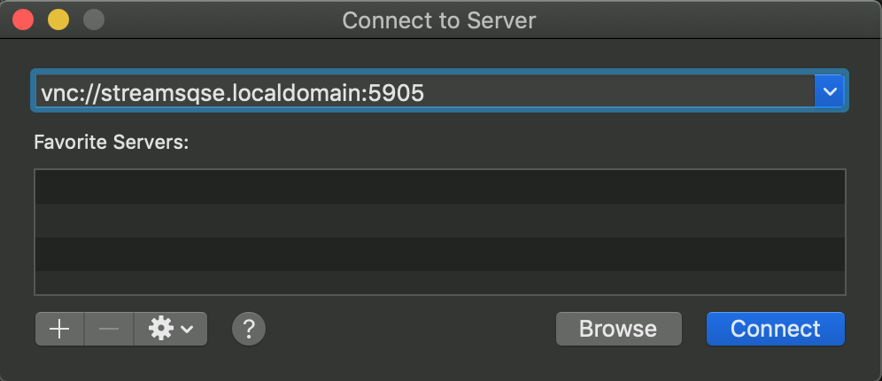

1. Launch Streams Studio

   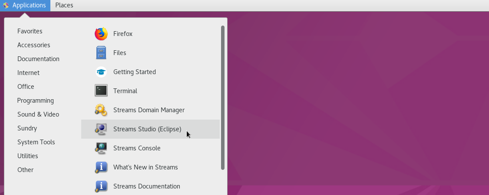

1. Create a new project

   - [ ] Select a workspace

   - [ ] If prompted to "Add Streams Domain connection", use the `Find domain...` button to select `streamsqse.localdomain`.

   - [ ] Use the upper-left pulldown to create a new project. When prompted to `Select a wizard`, use `IBM Streams Studio ▷ SPL Project`, hit `Next`, provide a name, and hit `Finish`.

1. Replace the Event Store toolkit

   - [ ] Using the `Project Explorer` tab, expand your new project, right-click on `Dependencies` and select `Edit Dependencies`. Remove `com.ibm.streamsx.eventstore` version 2.0.3. This is a newer version that does not work with our 1.1.4 Developer Edition of Event Store.

   - [ ] Using the `Streams Explorer` tab, expand `IBM Streams Installations` and `IBM Streams` to show `Toolkit Locations`. Right-click and select `Add Toolkit Location...`. Use the `Directory...` button and add the `/home/streamsadmin/hostdir/toolkits` directory (where you extracted the the streamsx.eventstore_1.2.0-RELEASE.tgz toolkit).

   - [ ] Back in the `Project Explorer` tab, right-click on `Dependencies` and select `Edit Dependencies`, `Add`, and `Browse`. Select `com.ibm.streamsx.eventstore 1.2.0` and hit `OK`. Now we are using the downloaded version that works with our 1.1.4 Developer Edition and ignoring the newer version.

     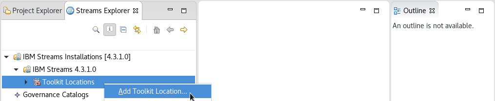

1. Create your file source

   - [ ] Copy the `data/sample_IOT_table.csv` file from your cloned repo to your hostdir.

   - [ ] In the `Project Explorer` tab, right-click on your project and select `New  ▷ Main Composite` and create a default `Main.spl`.

     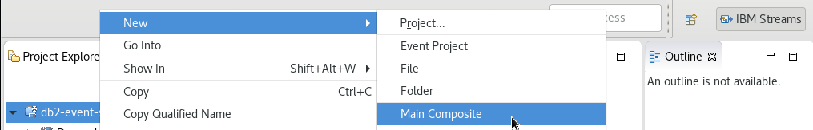

   - [ ] Using the SPL Graphical Editor for `Main.spl`, drag-and-drop the `Toolkits ▷ spl ▷ spl.adapter ▷ FileSource ▷ FileSource` into the `Main` box.

     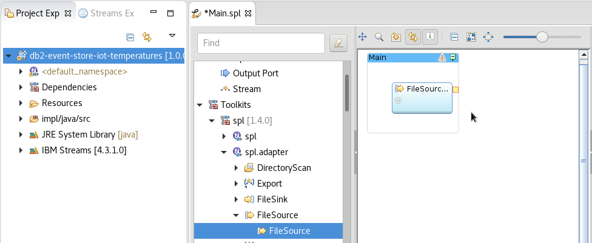

   - [ ] Double-click the FileSource box, select `Param` in the left sidebar, and edit the value to set it to `"/users/streamsadmin/hostdir/sample_IOT_table.csv"` (where you put the data file). Add a `format` parameter and set the value to `csv`.

     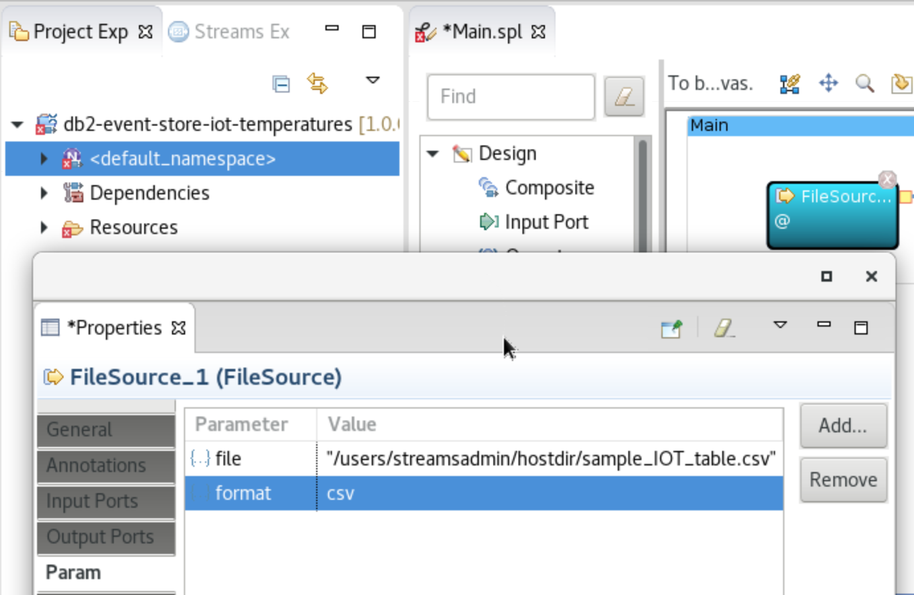

   - [ ] Select `Output Ports` in the left sidebar. Remove the `<extends>` row. Click on `Add attribute...`. Add attributes and types to create an output stream schema matching the contents of the CSV file and the Event Store table. The attribute names here don't matter, but the types do. Follow the example below.

     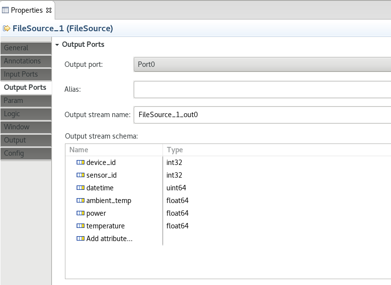

   - [ ] Close and save the FileSource properties.

1. Create your Event Store Sink

   - [ ] Using the SPL Graphical Editor for `Main.spl`, drag-and-drop the `Toolkits ▷ com.ibm.streamx.eventstore ▷ com.ibm.streamx.eventstore ▷ EventStoreSink` into the `Main` box (be sure to grab the 1.2.0 version).

   - [ ] Use your mouse and drag from FileSource output tab to the EventStoreSink input tab.

     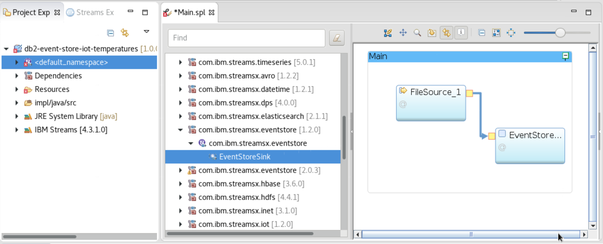

   - [ ] Double-click the EventStoreSink box, select `Param` in the left sidebar, and edit the values to set the connectionString, databaseName and tableName as shown below (but substitute your own Event Store IP address). Close and save.

     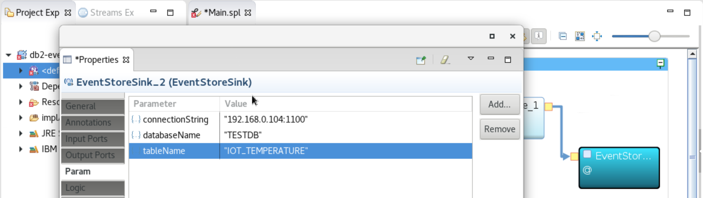

1. Launch

   - [ ] Save all your changes and let the build finish.

   - [ ] Right-click on your application (`Main`) and `Launch ▷ Launch Active Build Config as Standalone`.

     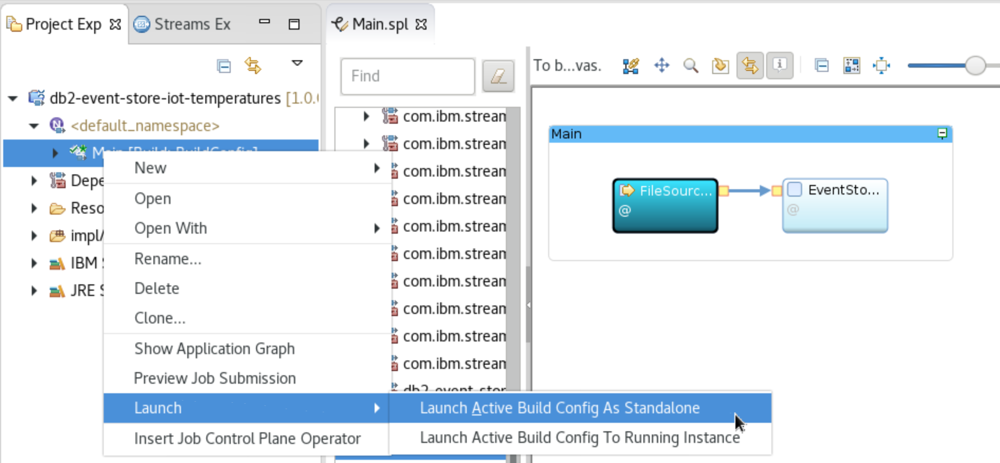

</p>
</details>

<details><summary>Use the Jupyter notebook to load the data</summary>
<p>

Use the Db2 Event Store UI to add the CSV input file as a data asset.

1. From the upper-left corner `☰` drop down menu, select `My Notebooks`.

   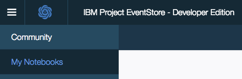

1. Scroll down and click on `add data assets`.

   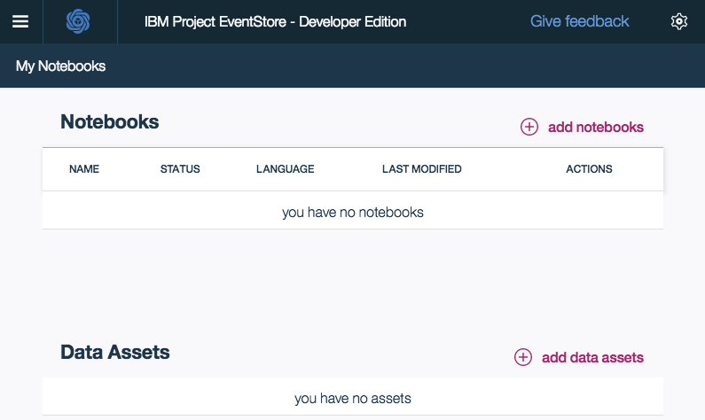

1. Click `browse` and navigate to the `data` directory in your cloned repo. Open the file `sample_IOT_table.csv`.

   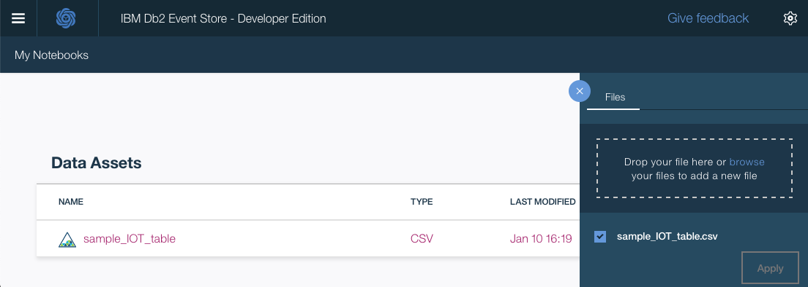

Follow the same process as above to add and run a notebook. This time choose the file named **`Event_Store_Data_Feed.ipynb`**.

The notebook loads the table with one million records from the CSV file that you added as a project asset.

</p>
</details>

### 5. Query the table

Follow the same process to add and run a notebook. This time choose the file named **`Event_Store_Querying.ipynb`**.

This notebook demonstrates best practices for querying the data stored in the IBM Db2 Event Store database. Verify that you have successfully created and loaded the table before continuing.

### 6. Analyze the data

Next, run the data analytics notebook. Use the file **`Event_Store_Data_Analytics.ipynb`**.

This notebook shows how the IBM Db2 Event Store can be integrated with multiple popular scientific tools to perform various data analytics tasks. As you walk through the notebook, you'll explore the data to filter it and example the correlation and covariance of the measurements. You'll also use some charts to visualize the data.

#### Probability plots, box plots, and histograms for temperature data

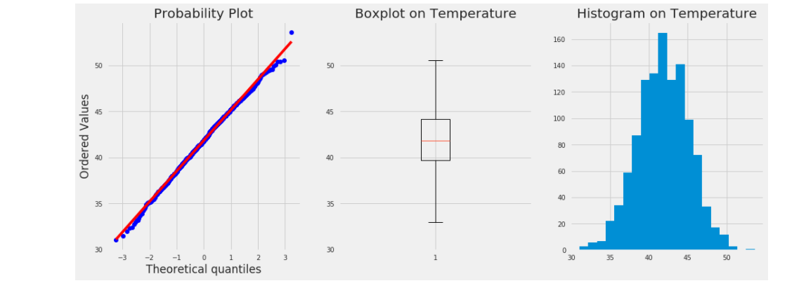

#### Scatter plots to show the relationship between measurements

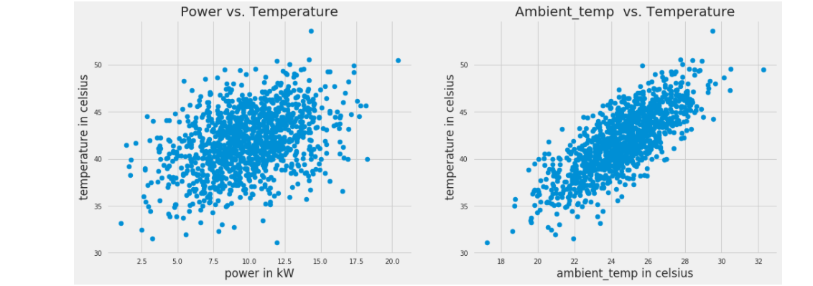

### 7. Create and deploy a machine learning model

This section demonstrates building and deploying a machine learning model. The notebook uses Spark MLlib to build and test a prediction model from our IoT temperature sensor data. At the end, it demonstrates how to deploy and use the model.

Load the notebook, using the file **`Event_Store_ML_Model_Deployment.ipynb`**.

If you are using the **Enterprise Edition** of Db2 Event Store, the notebook will deploy the model using Db2 Event Store which is built with Watson Studio Local. You can run the notebook as is.

If you are using the **Developer Edition** of Db2 Event Store, you need an IBM Cloud Watson Machine Learning service instance to complete the deployment. You'll need to run the following steps to deploy:

* Sign in and create the service [here](https://cloud.ibm.com/catalog/services/machine-learning).
* Create an API key or IAM token using the instructions [here](https://dataplatform.cloud.ibm.com/docs/content/wsj/analyze-data/ml-authentication.html). Keep this key/token handy for the next step.
* Scroll down to the section titled *With Db2 Event Store Developer Edition plus Machine Learning on IBM Cloud, save the model with metadata.*
Set your apikey and url in the `wml_credentials` section like so

```
wml_credentials = {
  "url": "https://us-south.ml.cloud.ibm.com",
  "apikey": "<apikey>"
}
```

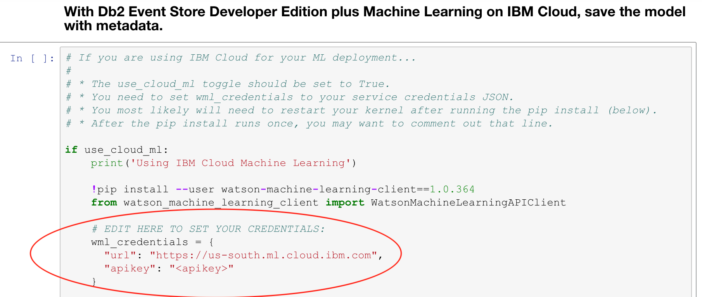


<!-- * Click on `Service credentials` and then `New credential` and `Add`.
* Use `View credentials` and copy the credentials JSON. -->
<!-- * You will use the JSON to set the `wml_credentials` variable in the notebook. -->
* The notebook will pip install watson-machine-learning-client. After the install, you usually need to restart your kernel and run the notebook again from the top.

Once the model is built and deployed, you can easily send it a new measurement and get a predicted temperature (one at a time or in batches).

#### Given a new data point

```python
new_data = {"deviceID" : 2, "sensorID": 24, "ts": 1541430459386, "ambient_temp": 30, "power": 10}
```

#### The result returns a predicted temperature

```python
predictions:  [48.98055760884435]
```

## Sample output

See all the notebooks with example output [here](examples).

